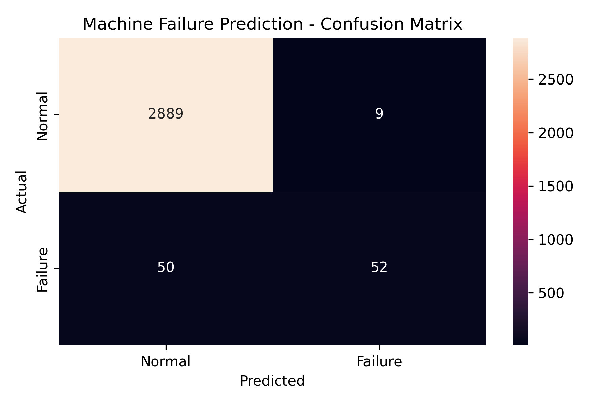
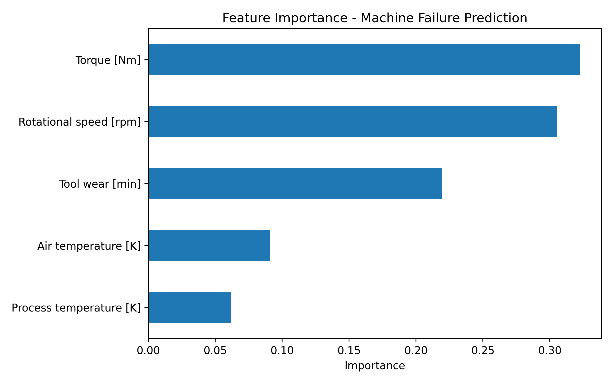

# Predictive Maintenance on Industrial Telemetry Data

I built this project to explore how machine learning can be used with sensor data to identify whether a machine is operating normally or a failure is likely to occur.

The main idea is to use machine telemetry such as temperature, rotational speed, torque, and tool wear and use these values to predict the machine status.

## Dataset

I used the **AI4I 2020 Predictive Maintenance Dataset**.

The dataset contains 10,000 records and 14 columns. For this project, I selected 5 sensor features:

- **Air Temperature [K]**
- **Process Temperature [K]**
- **Rotational Speed [rpm]**
- **Torque [Nm]**
- **Tool Wear [min]**

The target variable is `Machine failure`:

- `0` = Normal operation
- `1` = Machine failure

The dataset contains:

- 9,661 normal records
- 339 failure records

Since the number of failure records is much smaller than the normal records, this is an imbalanced classification problem. Because of this, I looked at precision, recall, and F1-score instead of relying only on accuracy.

## How I Built It

### 1. Data Preparation

I loaded the dataset using Pandas and checked its structure and missing values.

There were no missing values in the dataset.

I selected the 5 sensor features and the `Machine failure` column as the target.

The data was divided into:

- 70% training data
- 30% testing data

I used **stratified splitting** so that the proportion of normal and failure records was maintained in both the training and testing sets.

This resulted in:

- 7,000 training records
- 3,000 testing records

### 2. Model Training

I used a **Random Forest Classifier** for the first version of the project.

The model was configured with:

```python
n_estimators=100
random_state=42
class_weight="balanced"
```

I used `class_weight="balanced"` because the failure class is much smaller than the normal class. This gives more importance to the minority class during training.

### 3. Model Evaluation

I evaluated the model using:

- Precision
- Recall
- F1-score
- Confusion matrix

The results on the test data were:

| Class | Precision | Recall | F1-score |
|---|---:|---:|---:|
| Normal | 0.98 | 1.00 | 0.99 |
| Failure | 0.85 | 0.51 | 0.64 |

The overall accuracy was **98%**.

For the failure class, the recall was **0.51**. There were 102 actual failure records in the test set, and the model correctly detected 52 of them.

This showed that accuracy alone is not enough to understand the performance of the model on an imbalanced dataset.

## Confusion Matrix

The confusion matrix from the test data is shown below.



The confusion matrix was:

```text
                 Predicted
              Normal  Failure

Actual Normal   2889      9
Actual Failure    50     52
```

This means:

- 2,889 normal cases were correctly predicted as normal.
- 9 normal cases were predicted as failures.
- 52 failure cases were correctly detected.
- 50 failure cases were predicted as normal.

The 50 false negatives are an important area for improvement because they are actual failure cases that the model did not detect.

## Feature Importance

The feature importance graph from the Random Forest model is shown below.



The features were ranked approximately as follows:

1. Torque
2. Rotational Speed
3. Tool Wear
4. Air Temperature
5. Process Temperature

Torque and rotational speed had the highest feature importance in the trained model.

Feature importance shows which features the model relied on more when making predictions. It does not prove that a particular feature directly causes machine failure.

## Prediction

After training, I saved the Random Forest model using Joblib.

The saved model is located at:

```text
models/random_forest.pkl
```

I also created a `predict.py` script that allows new sensor values to be entered manually.

The script takes:

- Air temperature
- Process temperature
- Rotational speed
- Torque
- Tool wear

and returns:

- Machine status prediction
- Estimated failure probability from the trained model

I also tested the prediction script using a failure record from the dataset. In that test, the model produced an estimated failure probability of **97%** and predicted machine failure.

## Project Structure

```text
telemetry-fault-detection/
│
├── data/
│   └── predictive_maintenance.csv
│
├── models/
│   └── random_forest.pkl
│
├── outputs/
│   ├── confusion_matrix.png
│   └── feature_importance.png
│
├── train_model.py
├── predict.py
├── requirements.txt
└── README.md
```

## Technologies Used

- Python
- Pandas
- NumPy
- Scikit-learn
- SciPy
- Matplotlib
- Seaborn
- Joblib
- Requests
- VS Code

## Setup

Install the required packages:

```bash
pip install -r requirements.txt
```

## Running the Project

To train the model:

```bash
python train_model.py
```

To run the prediction program:

```bash
python predict.py
```

The confusion matrix and feature importance graph are generated in the `outputs` folder.

The trained model is saved in the `models` folder.

## What I Learned

While building this project, I learned how to:

- Load and inspect a machine learning dataset
- Work with sensor data
- Select features for a classification problem
- Handle an imbalanced target variable
- Use stratified train/test splitting
- Train a Random Forest classifier
- Evaluate a classification model
- Understand precision, recall, and F1-score
- Read a confusion matrix
- Analyze feature importance
- Save and load a trained model
- Use a trained model to make predictions on new sensor values

## Limitations

The dataset used in this project contains industrial machine data. It is not real UAV or drone telemetry.

The current model has a failure recall of 51%, so some actual failures are still missed.

Future work could include testing other classification models and prediction thresholds to see whether the failure recall can be improved.

The same approach could also be tested later with actual UAV telemetry such as motor temperature, RPM, vibration, battery voltage, and current.